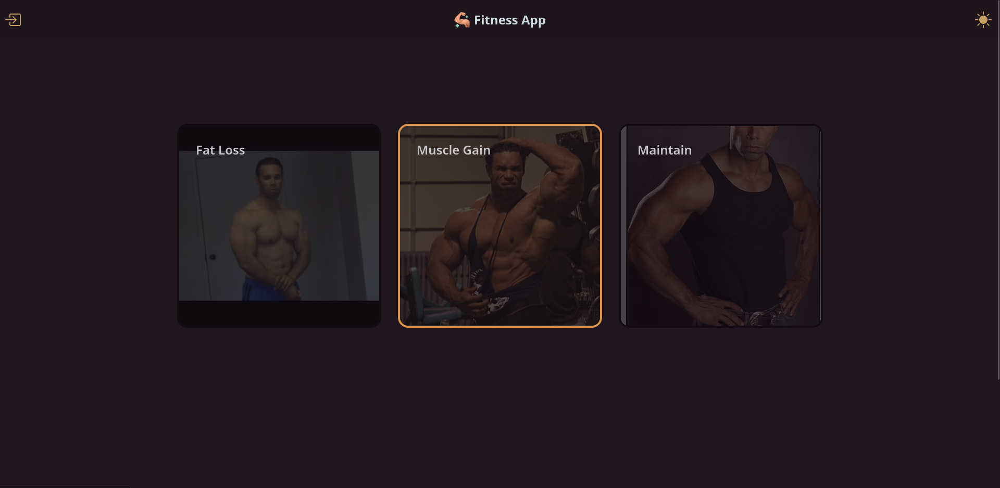
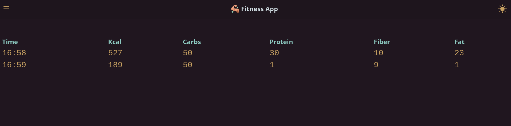
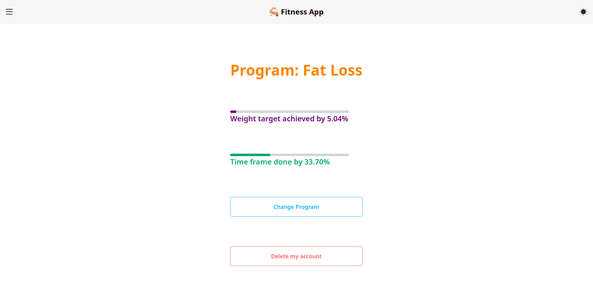
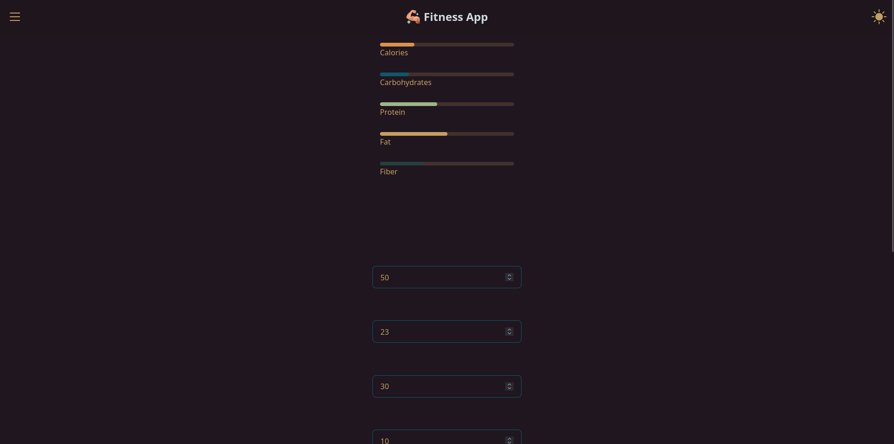
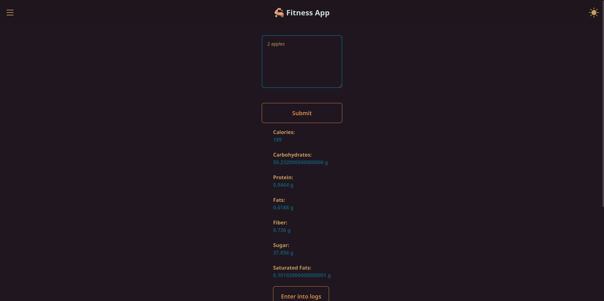
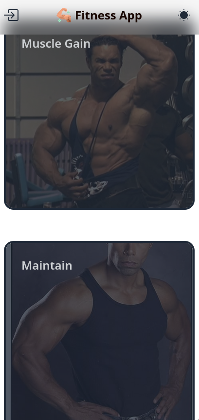

#  GoFit

#### Description
This is a personal project, it is a full fledged fitness tracker. There are 3 programs a user can select, fat loss, muscle gain and maintenance. Your calorie
deficit or surplus will be calculated based on the program you've selected and your weight, height, current weight and desired weight. It comes with a 
calorie calculator where you can enter the prompt in human readable text like "200 ml of whole milk" and it will output the nutrition of the input prompt.
You can even track your progress.
<br>
<br>

#### Motivation
Motivation for making this project was that I wanted an application to suggest the amount of calories something had and I wanted it to show me my deficit
if I am cutting or my surplus if I am bulking. I also was learning Go and HTMX and saw this as a great idea for a personal project.
<br>
<br>

## Interface
### Desktop

*Program selection*

 

*User logs*

 

*User profile*

 

*Daily input tracker*

 

*Signup page*

 

*Calorie calculator*

 

### Mobile

<p>
     
    
</p>


## Run
#### Setting up environment
###### Installing Go
```bash
rm -rf /usr/local/go && tar -C /usr/local -xzf go1.22.5.linux-amd64.tar.gzmake build
export PATH=$PATH:/usr/local/go/bin
go version
```
###### Installing Docker && postgres
```bash
sudo apt update
sudo apt install curl
curl -fsSL https://get.docker.com/ | sh
docker pull postgres
docker run -d --name <name> -p 5432:5432 -e POSTGRES_PASSWORD=<password> postgres
docker exec -it <name> bash
psql -h localhost -U postgres
CREATE DATABASE fitness;
```
###### Create a .env file with these parameters
```env
DB_TYPE=postgres
DB_URL=postgres://postgres:<your-password>@172.17.0.2:5432/fitness?sslmode=disable
BASE_URL=http://localhost:5000
JWT_SECRET=<your-secret>
API_APP_KEY=<your-api-key>
API_ACCESS_POINT=<your-access-point>
API_APP_ID=<your-api-id>
```
###### For api use [edamam](https://developer.edamam.com/edamam-nutrition-api-demo)
#### Execution
```bash
docker start <name-of-postgres-continer>
make intall
make migrageUp
make queries
make build
make run
```

## Tech Stack
+ **Frontend**\
    
    
    
    
    
+ **Backend**\
    
+ **Database**\
    
+ **Libraries**\
    
    
+ **Tools**\
    
    
    
    
